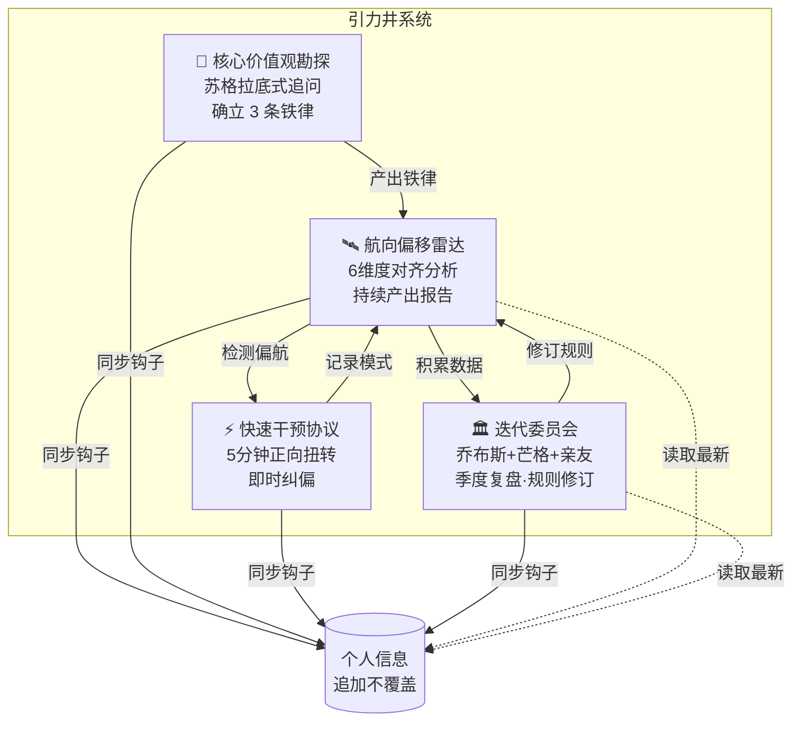

# 引力井 · Gravity Well

<div align="center">

> **「你不需要另一个待办清单，你需要一面镜子」**

[](LICENSE)
[](https://agentskills.io)
[](https://skills.sh)
[](#安装)

<br>

**引力井不告诉你去哪儿。它帮你看清你在往哪儿走，以及为什么。**

<sub>基于开放的 [Agent Skills 协议](https://agentskills.io)，可在 Claude Code、Codex、Cursor、OpenClaw、Hermes Agent、CodeBuddy、Workbuddy、Gemini CLI、OpenCode 等 50+ 兼容 runtime 中运行。</sub>

<br>

[功能](#功能) · [安装](#安装) · [使用](#使用) · [工作原理](#工作原理) · [仓库结构](#仓库结构) · [致谢](#致谢)

</div>

---

## 效果示例

```
用户      ❯ 这周学了三个新框架，做了两个demo，看了五篇论文，但什么都没完成。我是不是不够努力？

引力井    ❯ 雷达检测到偏航模式。你的铁律1是"通透认知"——但过去七天里，
            你用"学习"填满了所有时间，交付物为零。

            不是不够努力。是太努力了——努力到没时间问自己：
            "我学这个东西，是为了产出什么？"

            铁律2（主动判断）在呼叫你：选一个，干掉另外两个。
```

```
用户      ❯ 我陷入了无意义刷信息流，每天刷几小时，停不下来

引力井    ❯ ## 快速干预协议 - 信息流成瘾 - 2026-06-04

            ### 第1步：物理动作（30秒）
            现在站起来，拿手机走到另一个房间，屏幕朝下放在桌上，回到原位。

            ### 第2步：核心自问（1分钟）
            闭上眼睛想：我到底在用信息流逃避什么？

            ### 第3步：正向惯性（3分钟）
            打开一个你已经有进度但停在"能用"的项目，只做一个改动。
            不需要完成。只需要推进一小步。
```

```
用户      ❯ 召开季度委员会

（乔布斯+芒格+小龙自动入场，4项议程逐项交锋）

乔布斯     ❯ 电池系统是insanely great。另外两个项目是搁在架子上的原型。原型不是产品。
芒格      ❯ 同意诊断，不同意处方。问题不是学概念本身，是"用学概念替代产出"——激励结构错了。
小龙      ❯ 你明明知道那个按钮在哪。电池系统那天你按过一次。为什么不按第二次？

            [7项规则修订全票通过，下季度目标：小说评估项目P1→ship]
```

---

## 功能

四个子系统，覆盖从自我认识到行动的全流程：

| 子系统 | 触发方式 | 功能 |
|--------|---------|------|
| 🧭 **核心价值观勘探** | `开始勘探` `探索价值观` | 苏格拉底式追问，7-10轮渐进深挖，提炼 3 条铁律 |
| 🛰️ **航向偏移雷达** | 描述日常活动 | 6维度对齐分析（引力井对齐度、关键决策、精力情绪、时间偏差、错误航向、调整建议） |
| ⚡ **快速干预协议** | `我陷入了X` | 3步骤（物理动作→核心自问→正向惯性），5分钟可完成 |
| 🏛️ **迭代委员会** | `召开季度委员会` | 乔布斯+芒格+亲友多视角复盘，规则修订投票，季度杠杆目标 |

---

## 安装

引力井基于开放的 [Agent Skills](https://agentskills.io) 协议，可在任何 skills-compatible 的 AI agent runtime 中运行。

### 方式一：一行命令（推荐，跨 runtime）

打开你正在用的 agent（Claude Code、Codex、Cursor、OpenClaw、Hermes、CodeBuddy、Workbuddy、Gemini CLI、OpenCode 等），告诉它：

```
帮我安装这个 skill：https://github.com/violetGarend/gravity_well
```

或者用通用 CLI 安装器（[vercel-labs/skills](https://github.com/vercel-labs/skills)，支持 55+ runtime）：

```bash
npx skills add violetGarend/gravity_well
```

它会自动识别你当前的 runtime 并把 skill 放到正确目录。

### 方式二：手动安装

<details>
<summary>展开查看各 runtime 的 skills 目录</summary>

| Runtime | 安装路径 |
|---|---|
| Claude Code | `~/.claude/skills/gravity-well/` |
| Codex CLI | `~/.codex/skills/gravity-well/` |
| Cursor | `~/.cursor/skills/gravity-well/` |
| OpenClaw | `~/.openclaw/workspace/skills/gravity-well/` |
| Hermes Agent | 跑 `tools/install_hermes_skill.py` |
| 其他 runtime | clone 到对应 runtime 的 `skills/` 目录 |

```bash
git clone https://github.com/violetGarend/gravity_well <上面对应的路径>
```

</details>

### 方式三：作为参考资料使用

即使 runtime 不支持 Agent Skills 自动加载，你也可以直接把 `SKILL.md` 的内容粘贴进对话——它本质就是一份 markdown + YAML frontmatter。

---

## 使用

装好后，告诉 agent：

```
启动引力井
```

首次使用：选择数据存储目录（项目内 / 全局固定）→ 自动进入核心价值观勘探。

日常使用：

```
开始勘探                    → 苏格拉底式自我追问
今天做了一堆事但感觉没进展    → 自动触发航向偏移分析
我陷入了完美主义             → 5分钟快速干预
召开季度委员会               → 多视角复盘 + 规则修订
退出引力井                   → 恢复正常模式
```

所有数据（铁律、日志、会议记录）存储在你选择的本地目录中，完全属于你。

---

## 工作原理

引力井的四个子系统构成一个闭环：



**委员会子系统**内置 5 个人格视角文件（乔布斯、芒格、马斯克、Karpathy、Ilya），每个都包含完整的心智模型、表达 DNA、决策启发式、诚实边界。委员会通过读取这些文件来模拟角色发言——不是角色扮演，是用他们的认知框架帮你分析。

---

## 仓库结构

```
gravity-well/
├── SKILL.md                         ← 入口：触发词调度 + 核心规则（<100行）
├── README.md
├── references/                      ← 按需加载（progressive disclosure）
│   ├── 勘探.md                      ← 子系统1 完整流程
│   ├── 雷达.md                      ← 子系统2 分析模板
│   ├── 干预.md                      ← 子系统3 三步骤协议
│   ├── 委员会.md                    ← 子系统4 议程 + 角色模拟引擎
│   └── 人格skills/                  ← 5 个人格视角文件
│       ├── steve-jobs-perspective.md
│       ├── munger-perspective.md
│       ├── elon-musk-perspective.md
│       ├── andrej-karpathy-perspective.md
│       └── ilya-sutskever-perspective.md
└── assets/                          ← 模板文件
    ├── 铁律模板.md
    ├── 运营日志模板.md
    └── 日志索引模板.md
```

---

## 致谢

本 Skill 内嵌的 5 个人格视角文件由 **[Nuwa（女娲）](https://github.com/alchaincyf)** 原创制作，基于各人物公开言论、授权传记和访谈提炼。每个文件文末均有完整署名和来源声明。

> **女娲** 是花叔（[Alchain](https://github.com/alchaincyf)）开发的认知框架蒸馏工具——输入一个名字，自动完成调研、提炼、验证全流程，输出可运行的人格 Skill。去 [nuwa-skill](https://github.com/alchaincyf/nuwa-skill) 看看。

---

## 许可证

MIT。

---

<div align="center">

**引力井不告诉你去哪儿。它帮你看清你在往哪儿走，以及为什么。**

MIT License

</div>
